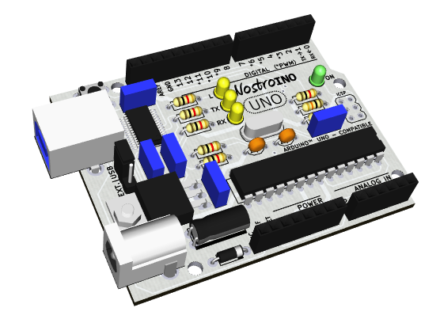

#NostroINO
Este projeto é baseado no Arduino UNO revisão 3, sendo 100% compatível com esta plataforma. A compatibilidade dos pinos permite que sejam utilizados os mesmos shields desenvolvidos para a família Arduino.

Além da compatibilidade dos pinos, a placa do Nostroino UNO possui as mesmas dimensões da placa do Arduino UNO e mantem os principais elementos (conector de alimentação, conector USB, conector ICSP, microcontrolador, botão reset e furos de fixação) conforme o layout do original.

Criado por André [Augusto Andreis](<andreis.andre@gmail.com>) e [Diego Volpini](https://github.com/dvolpini), com o objetivo de disponibilizar uma alternativa de menor custo e de fácil montagem, o Nostroino UNO tem por filosofia o uso de componentes de encapsulamento PTH (Pin Through Hole), com exceção do chip FT232, responsável pela comunicação USB, o qual é fabricado apenas em encapsulamento SMD (Surface Mounted Devices).

Desta forma, o Nostroino UNO é ideal para estudantes que desejam construir sua própria placa de microcontrolador baseado no ATmega328.

Nostroino está sendo distribuído segundo os critérios da [Open Source Hardware Association](http://www.oshwa.org/definition/portuguese/) e de acordo com a Atribuição-CompartilhaIgual 3.0 Brasil [(CC BY-SA 3.0 BR)](http://creativecommons.org/licenses/by-sa/3.0/br) da Creative Commons.

A documentação completa está disponível em [https://github.com/nostroino/UNO](https://github.com/nostroino/UNO)

